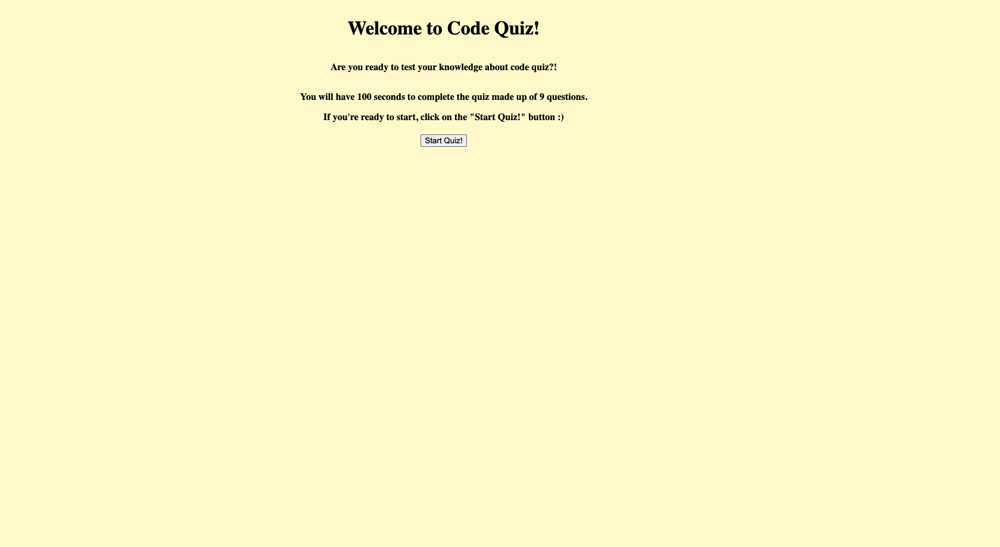
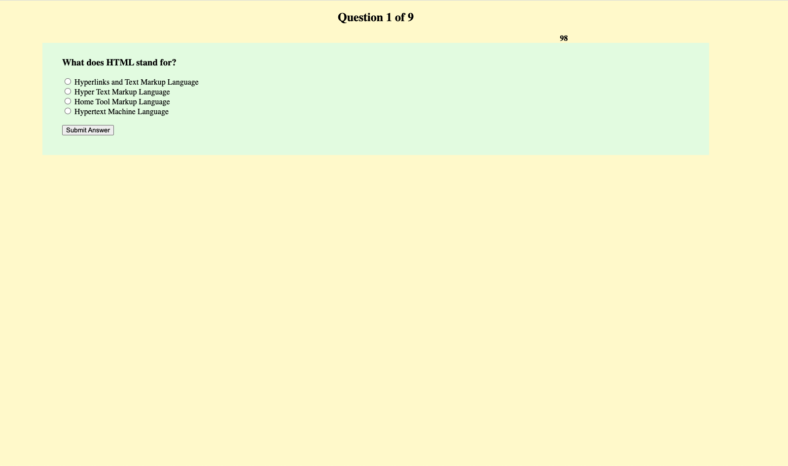

# homework-4-code-quiz

# Homework-4

## Project Overview

This is my homework #4 Code Quiz.

Objective from this week's homework was to build a timed coding quiz with multiple-choice questions. The web application was to run in the browser and feature dynamically updated HTML and CSS powered by JavaScript code. It was supposed to have clean, polished, and responsive user interface.

My logic behind this week's homework was to create a simple HTML (skeleton) and have a simple CSS and have most of my code edited in Javascript.

1. I created a start page where it introduces user to the code quiz application. It has a button labeled "Start Quiz!"
2. Once user clicks on it, it takes to the user to the quiz made up of 9 multiple choice questions.
3. I created the questions in an array of object that way it is easier to store the questions. After creating array of object I created 3-4 separate functions and wrote my code to automate as much as I could.
4. I also created a timer in the page, and it starts from 100, and it goes down to 1(0). In the beginning of the page, it showed the direction from to the user stating that they only have 100 seconds to finish the quiz.
5. I believe I have met every criteria from this week's assignment except, I was not able to subtract time from the timer when a user incorrectly clicks the wrong answer. The code quiz application also does not end the quiz when the timer reaches zero. I was not able to figure this part out, If allowed, I can make additional correction to the existing code quiz app in the future once I get proper feedback.

Attached is my screenshot of my code quiz age.



## Attached is also a personal link to my homework assignment #3

## https://jung0808.github.io/homework-4-code-quiz/

## https://github.com/jung0808/homework-4-code-quiz

At some point in your journey to become a full-stack web developer, you’ll likely be asked to complete a coding assessment&mdash;perhaps as part of an interview process. A typical coding assessment includes both multiple-choice questions and interactive coding challenges.

To help familiarize you with these tests and allow you to use the skills covered in this unit, this week’s homework invites you to build a timed coding quiz with multiple-choice questions. This app will run in the browser and will feature dynamically updated HTML and CSS powered by JavaScript code that you write. It will have a clean, polished, and responsive user interface.

This week’s coursework will equip you with all the skills you need to succeed in this assignment.

## User Story

```
AS A coding boot camp student
I WANT to take a timed quiz on JavaScript fundamentals that stores high scores
SO THAT I can gauge my progress compared to my peers
```

## Acceptance Criteria

```
GIVEN I am taking a code quiz
WHEN I click the start button
THEN a timer starts and I am presented with a question
WHEN I answer a question
THEN I am presented with another question
WHEN I answer a question incorrectly
THEN time is subtracted from the clock
WHEN all questions are answered or the timer reaches 0
THEN the game is over
WHEN the game is over
THEN I can save my initials and my score
```
